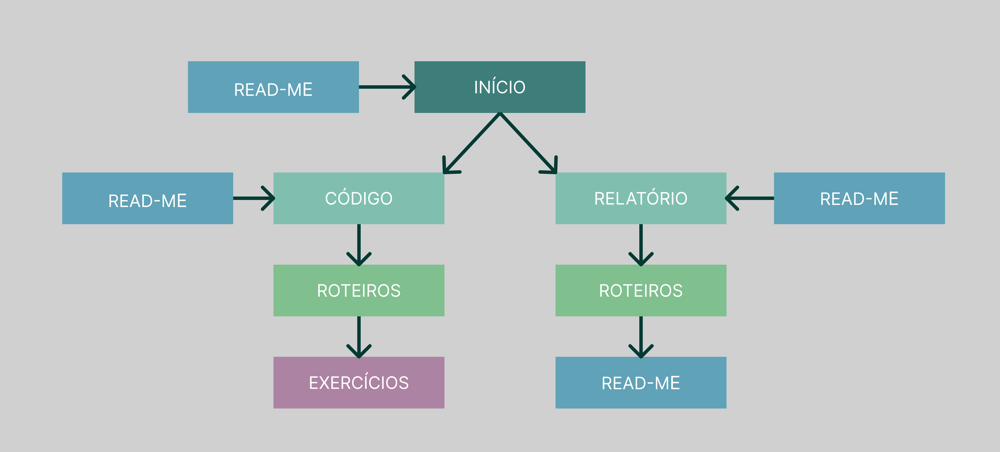

# Código da Prática 

Se encontra neste diretório todo o código fonte do projeto. 

Para executar os arquivos basta abrir um terminal integrado a pasta correspondeste do exercicio que deseja e rodar o comando "dotnet run".

# Fluxo de Arquivos

Os arquivos estão dispostos nas pastas conforme imagem abaixo:

