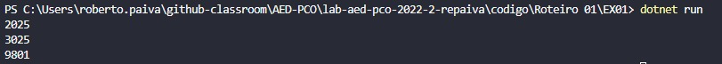
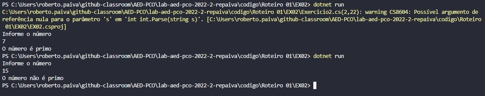
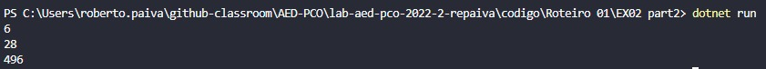
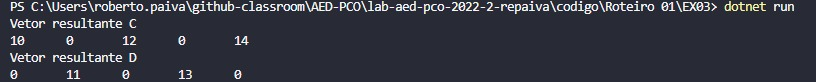
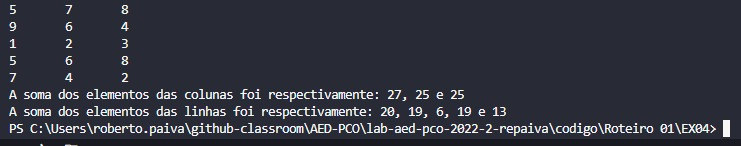
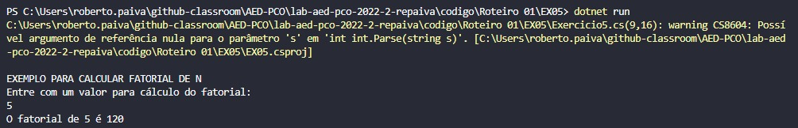
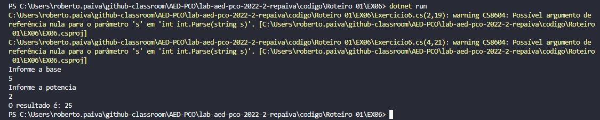

# Documentação da aula de laboratório

Para cada aula de laboratório, salvar print da execução de cada atividade com o resultado da execução do programa.

# Relatório exercício 01 - 

### Pergunta:

Alguns números de quatro algarismos possuem uma característica particular. Se separamos esse número em dois grupos e os somarmos encontramos um outro número cujo quadrado é exatamente igual ao número fornecido anteriormente. Veja o exemplo:
 
Número = 3025 
Separando o número em dois grupos de dois algarismos temos o 30 e o 25. 
A soma de 30 com 25 é igual a 55.
O Quadrado de 55 é igual a 3025.
 
Faça um programa que mostre os números de 1000 a 9999 que possuem essa característica.

### Resposta:

Para este programa criei uma estrutura de repetição de 1000 a 9999 onde a cada passo divido  o número por 100, para achar as centenas (primeira parte do número) e o resto são as dezenas (segunda parte do número), depois é só testar se a soma das duas partes ao quadrado é igual ao núemero inicial. 

# Relatório exercício 02 - 

### Pergunta:

Um Número é dito Primo se possui como divisores o número 1 e ele mesmo. Em outras palavras, um Número Primo possui dois divisores de 1 até ele.
Faça um programa que mostre se um determinado número inteiro, lido pelo teclado, é Primo.

### Resposta:

Para este programa chamei uma função onde contem uma estrutura de repetição de 2 ao proprio número -1, caso o número seja divisível pelo respectivo passo daquela estrutura de repetição, incrementa +1 a uma variável auxiliar. Caso ao final da repetição a variável sejá igual a zero o número é primo, se não não é primo.

# Relatório exercício 02 parte2 - 

### Pergunta:

Um Número é dito Perfeito se a soma de seus divisores menores que ele é igual a ele. Por exemplo, o número 6 possui os  divisores 1, 2 e 3, cuja soma é igual a 6.
Faça um programa que liste os números perfeitos de 1 a 1000.

### Resposta:

No programa principal deste exercício ocorre uma estrutura de repetição dentro de outra, para a cada passo na estrutura de fora (que conta todos os número de 1 a 1000), testa todos seus divisores possíveis chamando uma função "divisor", cada divisor encontrado é somado pela função soma. Ao fim da segunda estrutura de repetição imprimimos a soma na tela caso a soma encontrada seja igual ao número.

# Relatório exercício 03 - 

### Pergunta:

Faça um programa que receba os elementos de dois vetores, A e B, cada um com 5 posições. 
Considere que nenhum dos vetores possui elementos repetidos.
Crie um vetor resultante C que possua os elementos comuns entre A e B.
Crie um vetor resultante D que contenha os elementos de A que não existam em B.

### Resposta:

Para retornar os elementos comuns entre os dois vetores eu crio uma estrutura de repetição dentro de outra para a cada item do vetor A eu teste ele com todos os itens do vetor B, caso seja igual, o vetor C recebe esse elemento na posição do elemento. 
Para retornar os elementos diferentes, na mesma estrutura, eu crio uma variável auxiliar "cont" que me informa se o termo é igual entre os vetores, caso a variavel cont seja igual a zero quer dizer que não, assim eu insiro ela no vetor D na mesma posição do elemento e zero a variavel para o próximo passo.

Itens dos vetores:

float []a = new float[5]{10, 11, 12, 13, 14}
float []b = new float[5]{8, 9, 10, 12, 14}

# Relatório exercício 04 - 

### Pergunta:

Faça um programa que receba os elementos de uma matriz de 5 linhas por 3 colunas. 
Mostre a soma dos elementos de cada uma das linhas e das colunas da matriz.

### Resposta:

Criei duas funções, uma para a soma de linhas e outras de coluna. Na função "somaColuna" e "somalinha" a ideia é bem parecida. Percorremos os elementos da matriz através de uma estrutura de repetição, a matriz recebe duas variaveis com a posição dos elementos, uma recebida na chamada da função que nos diz qual a coluna  ou linha deseja somar, e a variavel "i" que percorre os elementos da respectiva linha ou coluna. As demais funções são para receber os valores e exibir a matriz.

# Relatório exercício 05 - 

### Pergunta:

Faça um programa que chame uma função capaz de calcular o Fatorial de um número inteiro.

### Resposta:

O pragrma possui uma estrutura de repetidação do while que serve para mantermos um loop, a cada vez que achamos o fatorial perguntamos se deseja calcular um novo valor digitando "S" ou encerrar o programa digitando qualquer outra coisa. 
Depois testamos se o número recebido é maior ou igual a zero, tendo em vista que não existe fatorial de números negativos em nosso escopo. A próxima etapa é colocarmos o valor recebido pelo programa em uma variável auxiliar "número" que vamos decrementando até chegarmos a 0, e a cada passo desse loop uma variável "Fat" recebe ele mesmo vezes a váriavel auxiliar "número".

# Relatório exercício 06 - 

### Pergunta:

Faça um programa que chame uma função capaz de calcular x elevado a y, sendo x e y inteiros. 
Utilize passagem por parâmetros por referência.

### Resposta:

Neste exercício criei uma função "potencia" onde há um estrutura de repetição simples de 1 a ao número do expoente e a cada passo a base ira receber o valor da base vezes a nova base, para isso foi necessário uma variável auxiliar para manter a base inicial fixa. 

