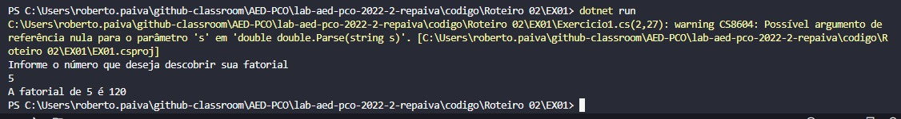
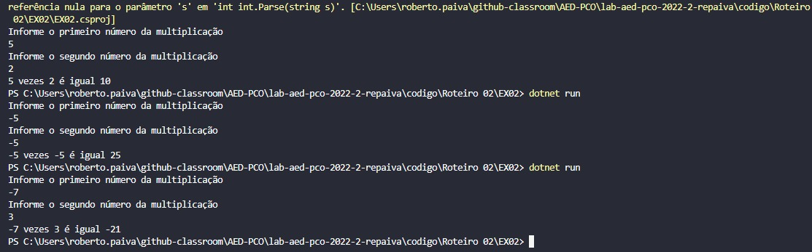
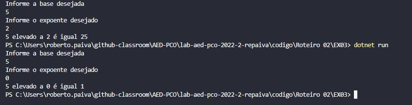
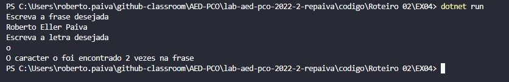
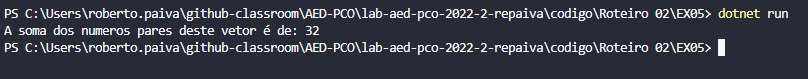

# Documentação da aula de laboratório

Para cada aula de laboratório, salvar print da execução de cada atividade com o resultado da execução do programa.

# Relatório exercício 01 - 

Pergunta:

Escreva um método recursivo que retorne o fatorial de um número.

Resposta:

Nosso escopo só vai até fatorial de zero ou números positivos (maiores ou igual a zero), logo, a fatorial de zero é 1 e por isso fiz dessa a condição de parada. A cada vez que chamamos a função recursiva multiplicamos o número vezes ele mesmo -1, assim empilhando através da recursividade a lógica de fatorial.

# Relatório exercício 02 - 

Pergunta:

Uma multiplicação pode ser vista como uma sequência de somas. Escreva um método recursivo que realize a multiplicação de dois números inteiros, A e B, recebidos por parâmetro.

Resposta:

Nossa condição de parada nesse caso é quando a variável B é igual zero, pois todo número somado a zero é ele mesmo. Após isso tivemos que separar em 3 tipos de empilhamentos para realizar as somas sucessivas. Separamos em quando não há números negativos, quando há somente um números negativos e quando ambos os números são negativos. Também foi necessário criar uma variável auxiliar para permitir que a multiplicação por -1 ocorra uma única vez em caso que ambos os números sejão negativos.

# Relatório exercício 03 - 

Pergunta:

Escreva um método recursivo que realize a potenciação entre dois números inteiros, A e B, recebidos por parâmetro. Seu método deve, portanto, retornar o resultado de A elevado a B

Resposta:

A condição de parada nesse caso é quando o expoente alcança zero, pois todo número elevado a zero é 1. Tendo isso em vista basta realizar o empilhamento através da recursividade multiplicando a base pelo retorno da condição de parada. 

# Relatório exercício 04 - 

Pergunta:

Escreva um método recursivo que receba uma frase e uma letra como parâmetros. Este método deve retornar a quantidade de ocorrências desta letra nesta frase.

Resposta:

A condição de parada do empilhamento é "if(texto=="")" pois é como testamos se a string chegou ao final. Após isso foi necessário fazer outro teste para descobrirmos se houve ou não a ocorrência do caracter desejado na frase, em caso de ocorrência vamos para próxima letra da strig e somamos +1, caso de não ocorrência simplesmente vamos para próxima letra. 

# Relatório exercício 05 - 

Pergunta:

Escreva um método recursivo que calcule a soma dos elementos de valor par de um vetor de números inteiros positivos.

Resposta:

Criei o seguinte vetor de referência para a execução do programa:
int []A = new int []{5, 2, 3, 8, 7, 20, 15, 2, 1}

Tendo o vetor acima em vista, criei também uma variável "pos" para percorrer esse mesmo vetor, quando a variável pos é igual a -1 quer dizer que seu vetor acabou, pois não existe a posição -1 em um vetor. Esse é seu ponto de parada.
Após isso realizamos um outro teste para descobrimos se o item presente naquela posição do vetor é par, caso for, somamos esse item ao somatório, caso não, pulamos para próxima posição do vetor e repetimos o ciclo.

# Relatório exercício 06 - 

Pergunta:

Escreva um método recursivo que receba uma frase e retorne a mesma frase, sem nenhuma vogal. 

Resposta:

