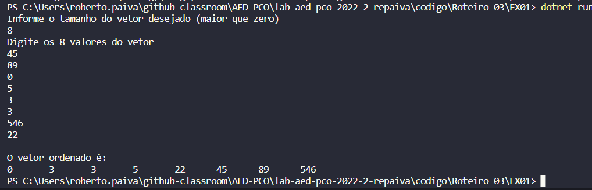
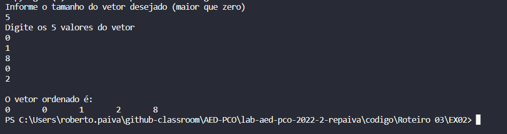
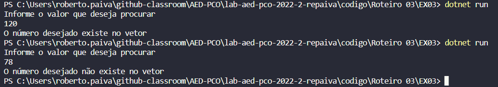
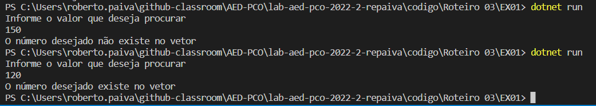

# Documentação da aula de laboratório

Para cada aula de laboratório, salvar print da execução de cada atividade com o resultado da execução do programa.

# Relatório exercício 01 - 

### Pergunta:

Ordenação binária com pos

### Resposta:

A ordenação binária com o auxiliar pos se assemelha muito a ordenação sem o pos, tendo em vista que não há a necessidade da mesma. A explicação mais completa da resolução se encontra na próxima questão, aqui é importante ressaltarmos somente que o "pos" cumpre o papel de ir nos informar o tamanho do vetor que vamos quebrando recursivamente a cada ciclo. 

# Relatório exercício 02 - 

### Pergunta:

Ordenação binária sem pos 

### Resposta:

Nesse exercício há várias funções, "lerVet" para ler o vetor desejado pelo usuário, "imprimeVet" para imprimir esse vetor no terminal, "parteVet" para partir o vetor de forma binária e recursiva, e por fim "ordenaVet" que faz as comparações entre os vetores para ordena-los. A função parteVet parte e prenche os vetores auxiliares A, B, ordeB e ordeC de forma recursiva até a condição de parada que neste caso é quando o vetor tenha somente uma posição. Após isso a função chama a função ordenaVet passando os vetores ordeB e ordeC com uma uma única posição, conforme a ideia de partição binária, assim tendo a certeza de que os vetores passados para a função ordenaVet estão ordenados. 

# Relatório exercício 03 - 

### Pergunta:

Pesquisa binária com pos

### Resposta:

A pesquisa binária com o auxiliar pos se assemelha muito a pesquisa sem o pos, tendo em vista que não há a necessidade da mesma. A explicação mais completa da resolução se encontra na próxima questão, aqui é importante ressaltarmos somente que o "pos" cumpre o papel do "meio" do próximo exercício. 

# Relatório exercício 04 - 

### Pergunta:

Pesquisa binária sem pos

### Resposta:

Para essa questão foi necessário criar um vetor auxiliar B que a cada ciclo da recursividade partia o vetor ao meio. Esse vetor auxiliar B é passado como parâmetro de entrada na próxima chamada da função, assim montando um ciclo. É necessário também realizar alguns testes, sendo eles, "if(vet[meio]== pesq)" que é nossa conidção de parada, testa se o número desejado é igual ao meio, partindo o vetor no meio a cada ciclo uma hora entraremos nesse if caso o número desejado exista no vetor. Caso não entre no if anterior, testamos se o meio é igual a zero, pois, se o meio é igual a zero e não entrou no if anterior obrigatoriamente não existe o parâmetro no vetor, assim retornando -1. Caso não entre em nenhum dos returns anteriosres há mais dois testes para descobrirmos se vamos prencher o vetor auxiliar B com a parte de superior ou inferior ao meio.

O vertor utilizado na execução do pragrama foi:
int []A = new int []{10, 20, 30, 80, 100, 120};

