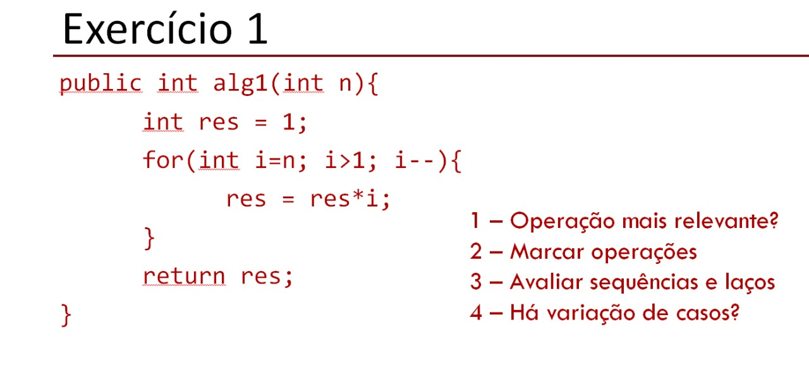
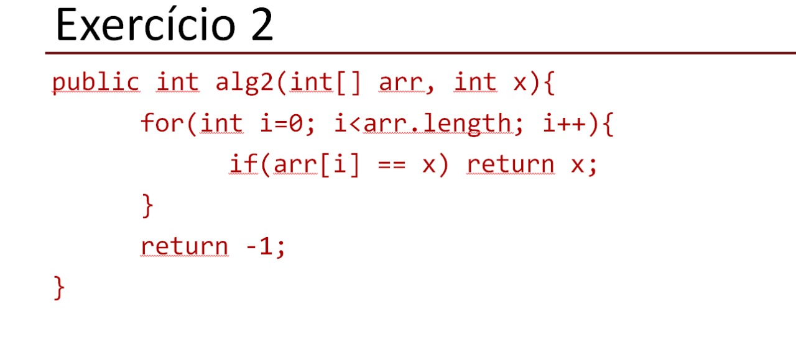
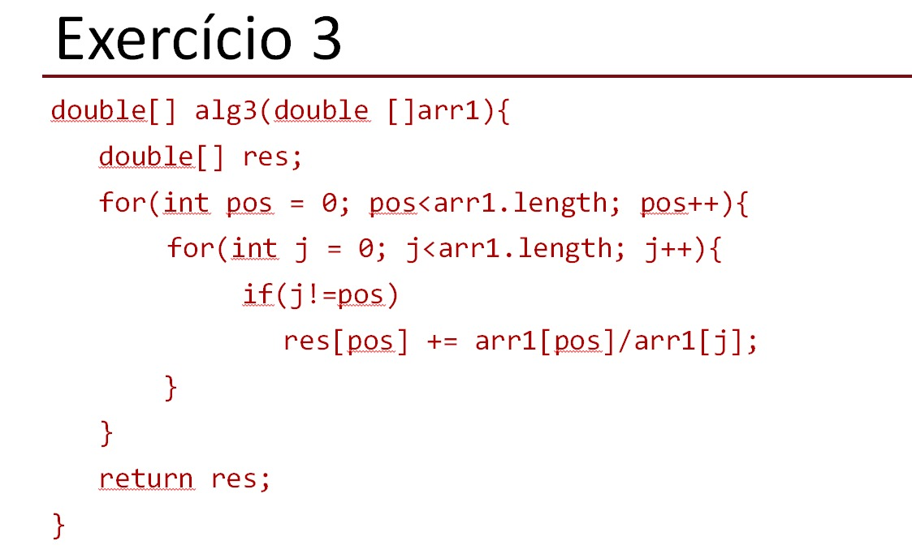
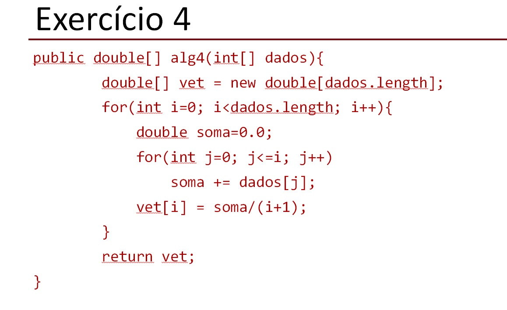

### 01- Operção mais relevante?

A operação mais relevante é atribuição.

### 02- Marcar operações.

Em comentários.

### 03- Avaliar sequências e laços. 

Atribuições -> n+(n-1) = n.
Multiplicação -> n-1. 

### 04- Há variações de casos? 

Não há variações de casos.

### 01- Operção mais relevante?

A operação mais relevante é a comparação.

### 02- Marcar operações.

Em comentários.

### 03- Avaliar sequências e laços. 

Comparações -> (n-0) = n.

### 04- Há variações de casos? 

Sim. No melhor caso x está na primeira posição do vetor, no pior caso ele não existe no vetor, os demais casos são considerados casos médios.

### 01- Operção mais relevante?

A operação mais relevante é a comparação.

### 02- Marcar operações.

Em comentários.

### 03- Avaliar sequências e laços. 

Comparação -> (n*n) = n^2 (n ao quadrado).
Atribuição -> (n*n)-n = n^2 -2.
Atribuição -> (n*n)-n = n^2 -2.
Divisão -> (n*n)-n = n^2 -2.
Soma -> (n*n)-n = n^2 -2.

### 04- Há variações de casos? 

Não há variações de casos.

### 01- Operção mais relevante?

A operação mais relevante é a atribuição.

### 02- Marcar operações.

Em comentários.

### 03- Avaliar sequências e laços. 

Atribuição -> 2n+n^2.
Divisão -> n.
Soma -> n+n^2.

### 04- Há variações de casos? 

Não há variações de casos.
