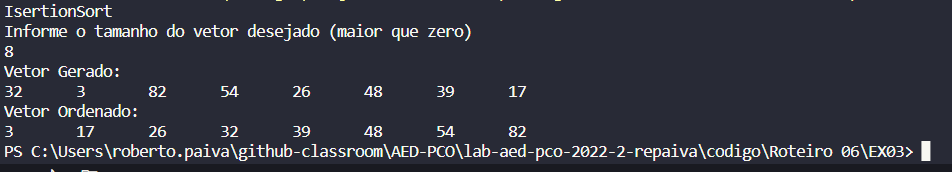
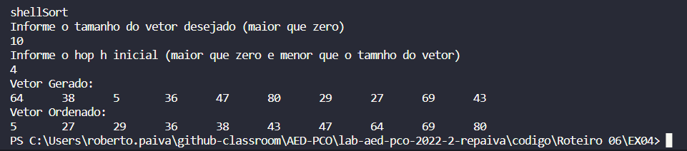
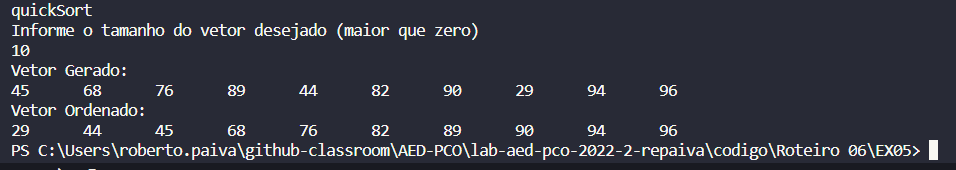

## BUBBLESORT

Para o BubbleSort oma-se uma posição de referência e para cada posição do início até a referência, se o valor for maior que o valor seguinte, trocam-se os valores, repetindo até usar todas as posições do vetor.

## SELECTSORT

No SelectSort selecionamos o menor valor do conjunto para a próxima posição a ser ordenada, para cada posição de referência iniciando da primeira posição, selecionamos o menor valor do vetor trocamos com a posição de referência.

## ISERTIONSORT

No IsertionSort examinamos as posições anteriores à posição de referência, procurando o lugar correto para inserir o valor nesta posição. Para cada posição de referência, enquanto o valor anterior for maior que o valor de referência, voltamos uma posição  e avan;amos todos os elementos em uma posição, depos inserimos o elemento de referência na posição correta.

## SHELLSORT

No ShellSort definimos um salto de comparação (hop) para os elementos de referência. Os itens separados uns dos outros por este intervalo serão comparados e ordenados isoladamente. Aplicamos a ordenação por inserção em cada sequência de elementos diminuindo progressivamente o valor do hop até que seu valor chegue a 1.

## QUICKSORT

No QuickSort dividimos o problema da ordenação em ordenações de conjuntos menores (divisão e conquista). A partir da escolha do pivô arbitrária, criamos um conjunto de elementos maiores e outro de elementos menores que o pivô, separando maiores que o pivô à direita e menores à esquerda. Repitimos o processo para as partições resultantes que sejam maiores que um elemento.

## MERGESORT

No MergeSort dividimos o problema em subproblemas menores resolvendo cada subproblema, depois agrupamos as soluções do subproblema para a resposta. Há divisões recursiva em subvetores, uma ordenação parcial desses subvetores e por fim intercalamos os subvetores.

## COUNTINGSORT

No CountingSort em uma primeira passada, contamod quantos dados de cada valor esperado existem. Depois, em segunda passada, alocamos os dados de acordo com a contagem.

