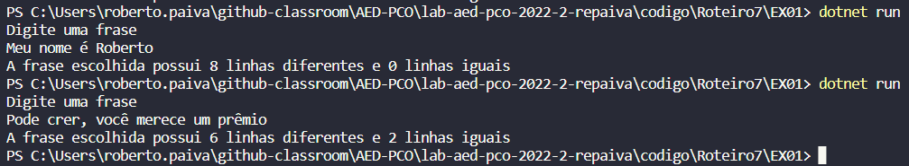
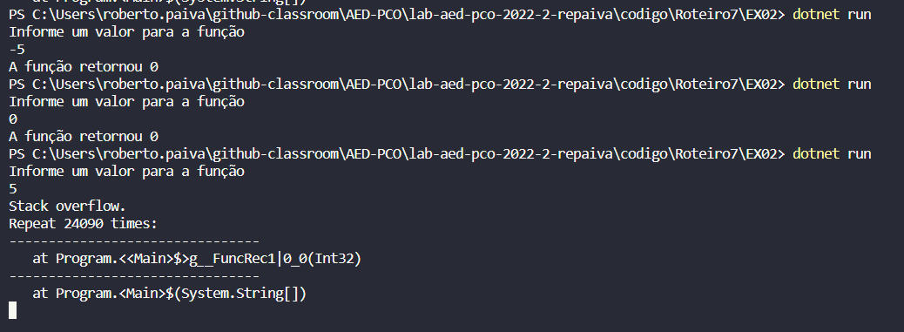
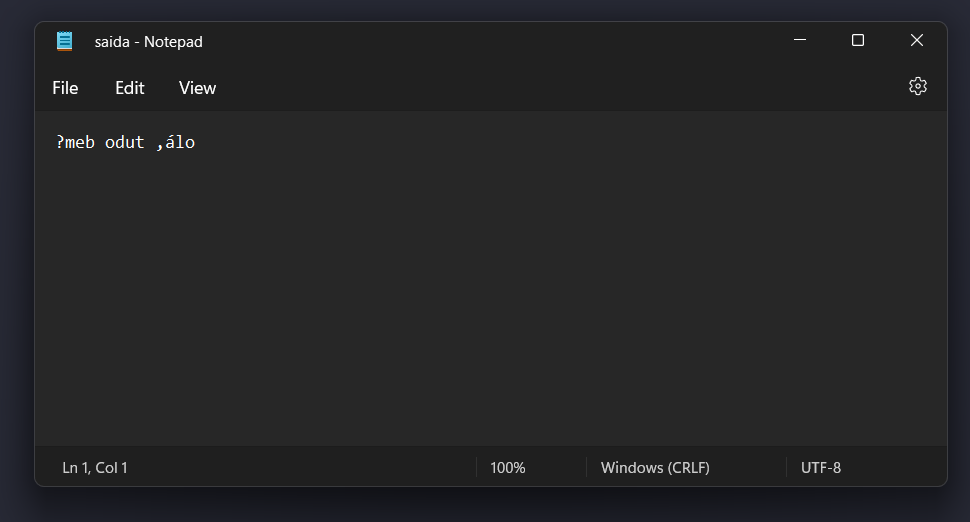
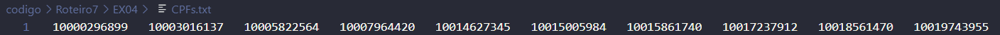
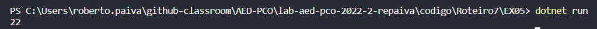

## Questão 01

No primeiro exercício da prova é necessário primeiramente ler uma frase digitada pelo usuário a fim de compararmos com o texto que leremos no arquivo "arq1.txt". Após a leitura da frase utilizamos o metodo "System.IO.File.ReadAllLines" para a leitura do arquivo e então armazenamos cada linha do arquivo em um vetor chamado "lines". Por fim utilizamos uma estrutura de repetição foreach onde a cada linha do arquivo fazemos a comparação se a mesma é igual a frase digitada pelo usuário, caso for, incrmentamos 1 na variável "igual", senão, incrementamos 1 na variável "diferente". por fim exibimos na tela ambas variáveis.

Operações mais relevantes: Atribuição, Comparação e Soma.

Complexidade: O(n).

## Questão 02
a) Temos uma condição de parada prevista na função, sendo ela, if(a<=1). Entretanto, por termos um loop infinito na função, o programa também interrompe a função quando indentifica o ciclo infinito.

b) Na segunda questão da prova reescrevi o código passado na questão e executarmos o programa. Confomre imagem abaixo, percebemos que temos um "over flow" ou loop infinito para entradas com valores positivos, isso devido a chamada recursiva que nunca alcaça a condição de parada (subtraindo 2 na variável "a", onde "a" é um número positivo, e depois somando 3, a chamada recursiva jamais passara um valor menor ou igual a 1). Já quando o valor inicial de "a" é um valor menor ou igual a 1, a função retorna zero de cara, como previsto pela condição de parada. 

c) Como explicado na modelagem acima, quando a entrada for um valor menor ou igual a um, não há um ciclo, retornando zero de cara. Para valores maiores que um subtraimos temos um loop infinito sendo para "a" = 6 -> (6-2)+5 -> (9-2)+5 -> (12-2)+5 assim por diante até o programa entender o Over FLow.

## Questão 03

Na terceira questão da prova primeiramente fazemos a leitura do arquivo "entrat.txt", o método utilizado para leitura é um pouco diferente do utilizado na primeira questão pois aqui queremos ler somente a primeira linha do arquivo. Depois utilizamos o método ToCharArray para converter a linha lida do arquivo em um vetor de caracteres, e então percorremos esse vetor de caracteres através de um for, onde a cada passo um vetor "resultado" recebe a última posição do vetor originado da leitura do arquivo. Por fim utilizamos o método Writer para escrever o vetor resultado no arquivo "saida.txt". 

Operações mais relevantes: Atribuição.

Complexidade: O(n).

## Questão 04

a) O especialista não escolheu o pior dos algoritmos para a solução, entretanto, há opções melhores para o caso como o prórpio ShellSort que é uma melhoria do IsertionSort. O InsertionSort é muito bom quando o vetor está previamente ordenado e temos que inserir algum dado, como não temos essa informação há melhores opções.

b) Eu utilizaria o QuickSort pois, tendo um banco de dados grande como 50 mil CPFs é muito pocuo provável termos o seu pior caso, e no caso médio o Quick é o algoritmo mais rápido conhecido.

c) O QuickSort tem como operações mais relevantes a comparação e a troca, tendo em vista as comparações e trocas com o pivô.

d) A demonstração do resultado de ordeção por QuickSorte com um vetor de 10 posições se encontra no print abaixo. 

## Questão 05

Na quinta questão da prova, reescrevi o código passado na questão e executarmos o programa. Obtivemos o resultado 22 confomre imagem abaixo.

