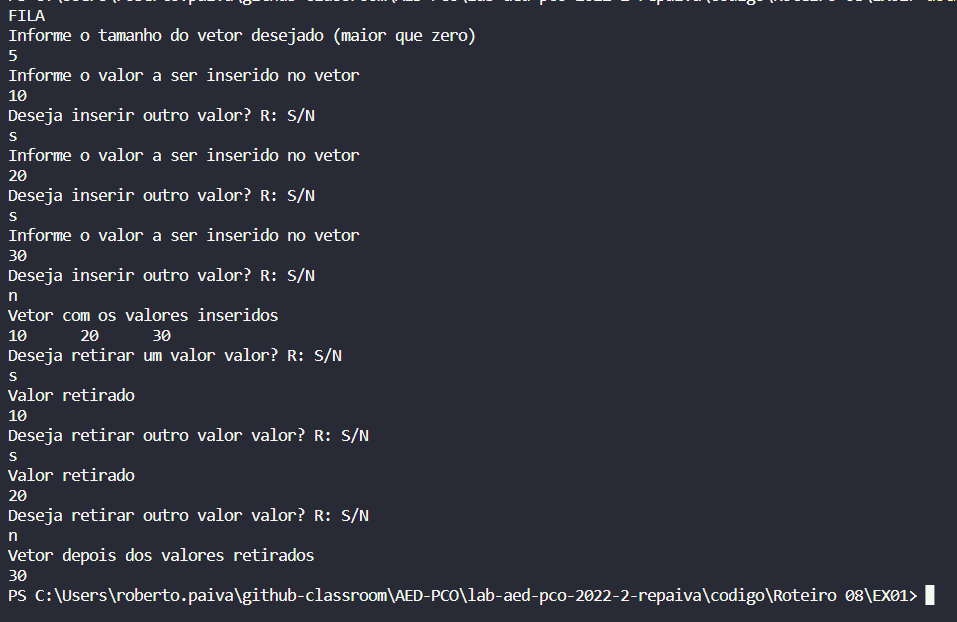
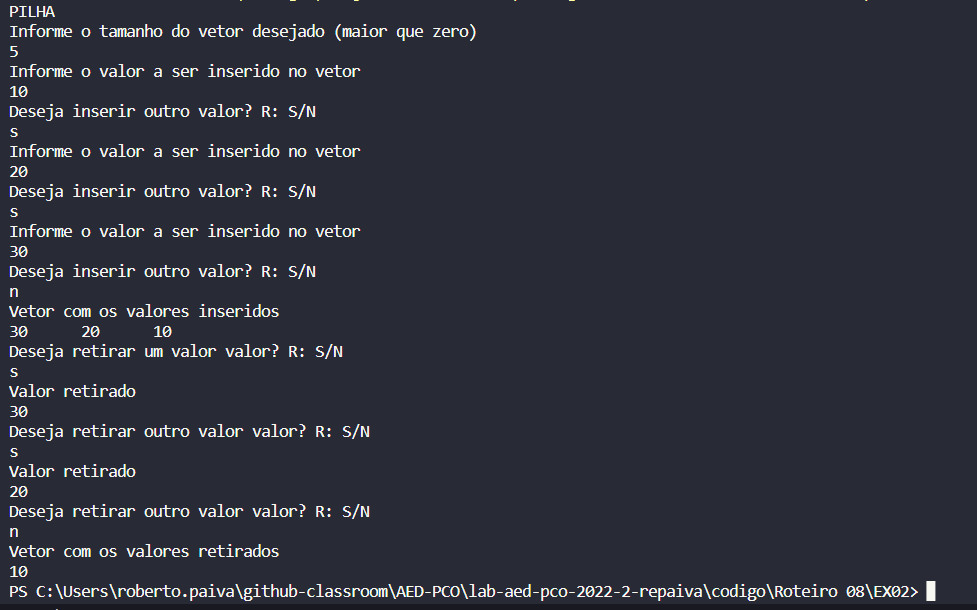
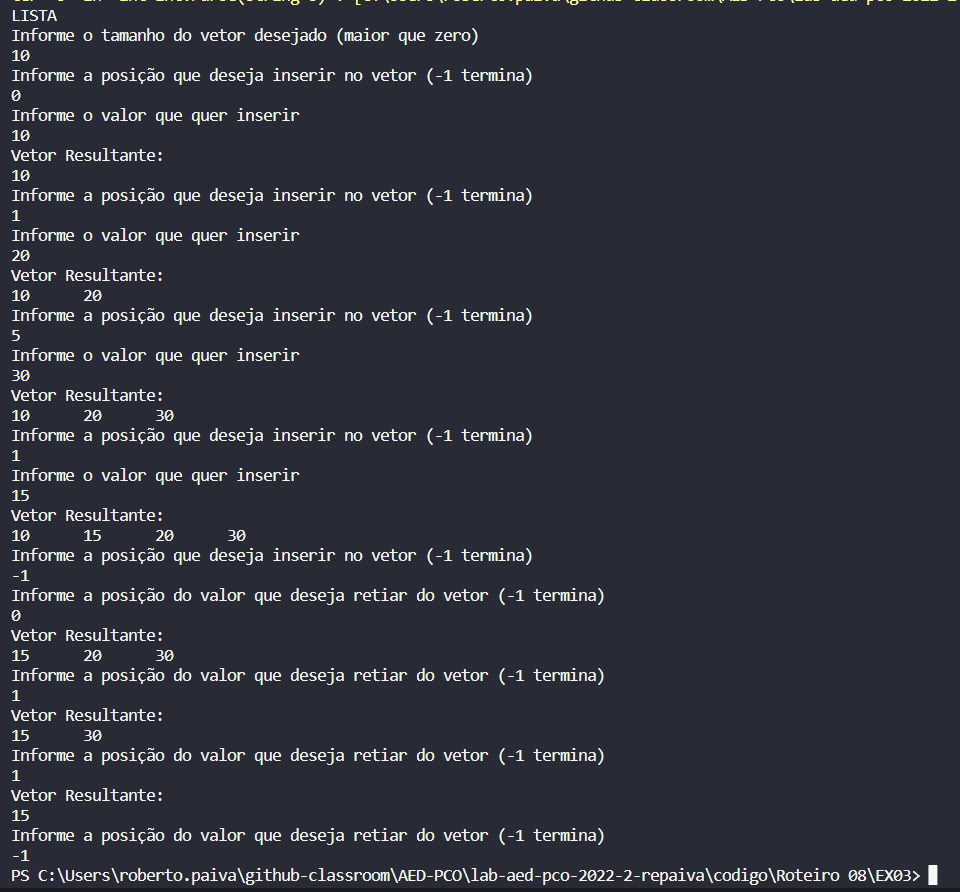

## Questão 01 - INSERÇÃO E RETIRADA NA FILA

Utilizei uma estrutura de repetição do while somente para termos em loop tanto na inserção quanto na retirada. Ademais, utilizei também uma variável global "aux" que controla o tamanho da FILA, é através dela que sabemos onde inserirmos o valor desejado pelo usuário e diminuimos o tamnho da FILA no caso da retirada. Para imprimir o vetor na FILA temos que retirar da primeira posição, exibir no console, andar com todos os valores para a esquerda e então guardamos o valor na ultima posição da FILA. 

## Questão 02 - INSERÇÃO E RETIRADA NA PILHA

Utilizei uma estrutura de repetição do while somente para termos em loop tanto na inserção quanto na retirada. Ademais, utilizei também uma variável global "aux" que controla o tamanho da PILHA. Nesta estrutura, sempre retiramos e inserimos o valor desejado na ultima posição da PILHA. Sendo assim, quando inserimos um valor basta inserir na posição aux e incrementar +1 na variavel aux. Já para retirarmos basta decrementar -1 na variavel aux. A função "imprimeVet" impreme o vetor no console de traz para frente pois é assim que a PILHA enxerga, (vemos da última posição inserida para a primeira).

## Questão 03 - INSERÇÃO E RETIRADA NA LISTA

Buscando a melhor usabilidade do programa, ao invés de um do while, utilizei um simples while com um flag -1. Também utilizei uma variável global "aux" que controla o tamanho da LISTA. Na estrutura LISTA podemos inserir e retirar os números de qualquer posição, entretanto, para não ficar com espaços vazios em nossa LISTA, quando o usuário deseja inserir um valor em uma posição maior que a variável de contrele de tamanho "aux", iserimos na ultima posição livre da LISTA. Caso o usuário deseje inserir um valor em uma posição que já possui outro valor, andamos com todos os valores a partir daquela posição para a direita, assim abrindo espaço, e então inserimos o valor e incrementamos +1 na variável "aux". Na retirada ocorre o processo inverso, quando desejado retirar um valor que não o primeiro ou o ultimo da lista, andamos com os valores da posição retirada até a final para a esquerda, assim cubrindo o espaço vazio do valor retirado, e decrementamos -1 no tamano da LISTA.

