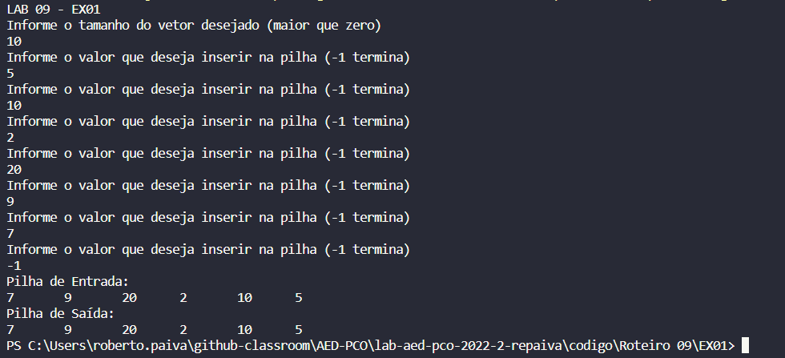
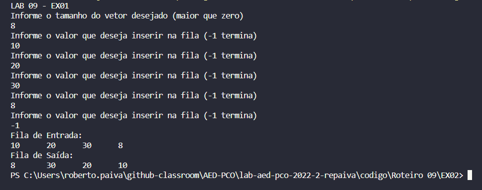

## Questão 01 - Copiar uma pilha para outra pilha mantendo na ordem original.

Nessa questão, no próprio progrma principal "main" fazemos um loop chamando a função de iserir valor na pilha com flag de -1, assim temos uma pilha inicial. Após isso, chamamos a função "PilhaParaPilha" que contém a solução do problema de fato. Nesta função, temos uma pilha auxiliar onde será inserido os valores removidos das pilha original, como na pilha só conseguimos remover valores da última posição, a pilha auxiliar tera os valores da pilha original de traz para frente. Na próxima etapa inserimos os valores dessa pilha auxiliar na pilha original e na pilha de saída, denovo, seguindo a filosofia da pilha, as pilhas original e de saída receberam os valores da pilha auxiliar de trás para frente, agora sim na ordem da pilha inicializada pelo usuário. Observação: os valores impressos no console mostram os valores da pilha de trás para frente pois é assim que a pilha enxerga.  

## Questão 02 - Copiar uma fila para outra fila invertendo a ordem original.

