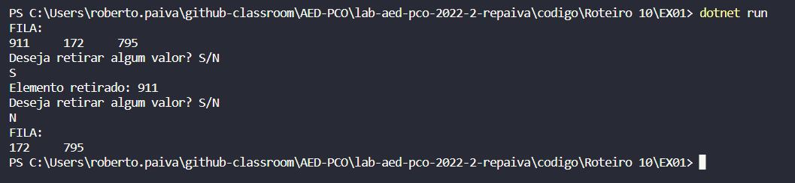
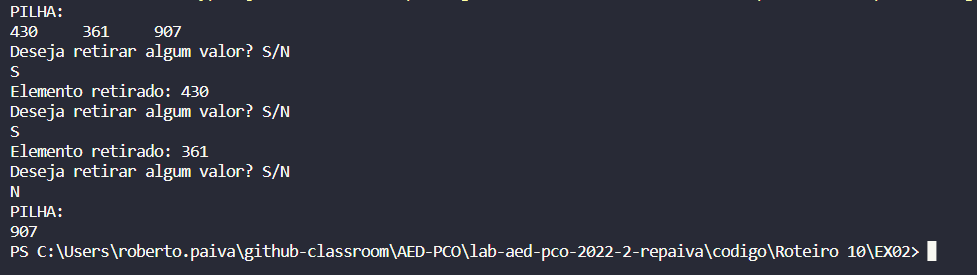
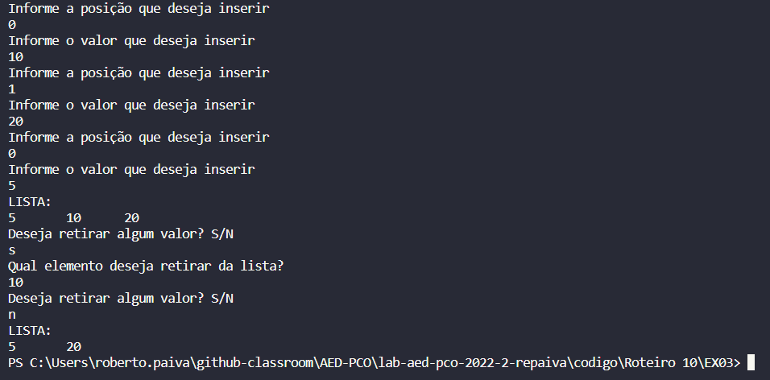

## Questão 01 - FILA DINÂMICA.

 Nessa questão, utilizando como base os slides estudados, criamos a classe/objeto "Aluno" contendo a propriedade "matrícula". Após isso também criamos a classe Elemento onde possui o objeto aluno mais o ponteiro de endereço de memória "proximo". Ainda temos a classe "Fila" onde se encontra as funções de inserir, retirar e imprimir a fila propriamente dita. Por fim, no programa principal, criamos três elementos distintos que receberão uma matrícula aleatória a ser informada pelo usuário, que são inseridos na fila atraves da função "inserir". Após a fila completa perguntamos a usuário se deseja remover algum valor com um loop de repição do while, caso positivo, chamamos a função "retirar" e retiramos da primeira posição.

## Questão 02 - PILHA DINÂMICA.

 Nessa questão, utilizando como base os slides estudados, criamos a classe/objeto "Aluno" contendo a propriedade "matrícula". Após isso também criamos a classe Elemento onde possui o objeto aluno mais o ponteiro de endereço de memória "proximo". Ainda temos a classe "Pilha" onde se encontra as funções de inserir, retirar e imprimir a pilha propriamente dita. Por fim, no programa principal, criamos três elementos distintos que receberão uma matrícula aleatória a ser informada pelo usuário, que são inseridos na pilha atraves da função "inserir". Após a pilha completa perguntamos a usuário se deseja remover algum valor com um loop de repição do while, caso positivo, chamamos a função "retirar" e retiramos da última posição.

 OBS: No console mostra a pilha de trás para frente pois é assim que a pilha exerga seu valores.

## Questão 03 - LISTA DINÂMICA.

 Nessa questão, utilizando como base os slides estudados, criamos a classe/objeto "Aluno" contendo a propriedade "matrícula". Após isso também criamos a classe Elemento onde possui o objeto aluno mais o ponteiro de endereço de memória "proximo". Ainda temos a classe "Lista" onde se encontra as funções de inserir, retirar e imprimir a lista propriamente dita. Por fim, no programa principal, criamos três elementos distintos que receberão uma matrícula aleatória a ser informada pelo usuário, que são inseridos na lista atraves da função "inserir". Após a lista completa perguntamos a usuário se deseja remover algum valor com um loop de repição do while, caso positivo, chamamos a função "retirar" e retiramos da lista o valor digitado pelo usuário.

