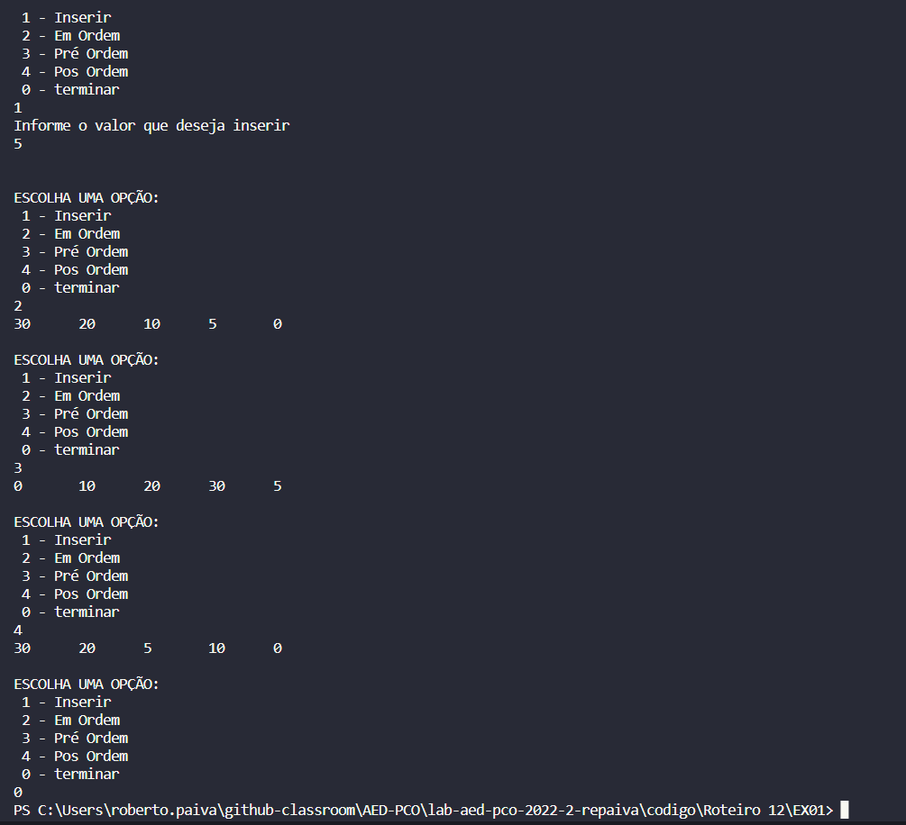

## Questão 01 - ÁRVORE ABB.

Nessa questão criamos a classe "no" que possui dois filhos, um a esquerda e outra a direita, ambos apontando para nulo de início. há também a função inserir, que insere os valores desejado pelo usuário. Na função inserir fazemos teste de maior e menor para sabermos se vamos posicionar o valor a ser inserido à direita ou à esquerda do no raiz, e o no raiz vai atualizando a cada chamada recursiva. Por fim temos as funções de impressão Em Ordem, Pos Ordem e Pré Ordem.

